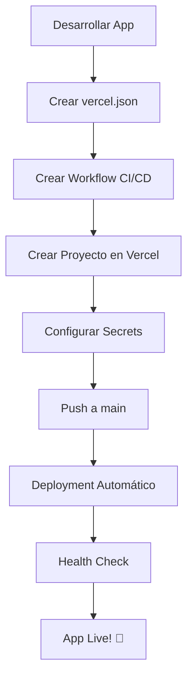
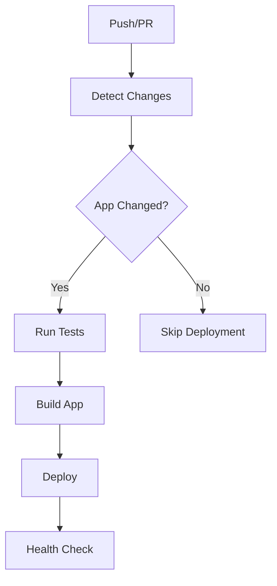

# Deployment Process - Sync Platform

## 🎯 Estrategia de Deployment

El monorepo utiliza **proyectos separados** en Vercel para cada aplicación, permitiendo deployment independiente y escalabilidad.

## 📱 Aplicaciones y URLs

| Aplicación | URL de Producción | Estado | Workflow |
|------------|-------------------|---------|----------|
| CrediSync  | `credisync-green.vercel.app` | ✅ **ACTIVO** | `credisync-deploy.yml` |
| HealthSync | `healthsync.vercel.app` | 🚧 **PREPARADO** | `healthsync-deploy.yml` |
| SurveySync | `surveysync.vercel.app` | 🚧 **PREPARADO** | `surveysync-deploy.yml` |

## 🚀 Proceso de Deployment

### 1. **CrediSync (Activo)**

**Status**: ✅ **FUNCIONANDO EN PRODUCCIÓN**

**Configuración:**
- **Proyecto Vercel**: `credisync`
- **URL**: https://credisync-green.vercel.app/
- **Build Command**: `cd ../.. && pnpm build:packages && pnpm build:credisync`
- **Deployment**: Automático en push a `main`

**Workflow**: `.github/workflows/credisync-deploy.yml`
- ✅ Tests de packages
- ✅ Tests de CrediSync
- ✅ Preview deployments en PRs
- ✅ Production deployment automático
- ✅ Health checks post-deployment

### 2. **HealthSync (Preparado)**

**Status**: 🚧 **LISTO PARA ACTIVAR**

**Configuración preparada:**
- **Proyecto Vercel**: `healthsync` (por crear)
- **URL**: https://healthsync.vercel.app/ (futura)
- **Build Command**: `cd ../.. && pnpm build:packages && pnpm build:healthsync`
- **vercel.json**: ✅ Configurado

**Para activar:**
1. Desarrollar la aplicación HealthSync
2. Crear proyecto en Vercel Dashboard
3. Configurar secrets: `VERCEL_PROJECT_ID_HEALTHSYNC`
4. Activar workflow

### 3. **SurveySync (Preparado)**

**Status**: 🚧 **LISTO PARA ACTIVAR**

**Configuración preparada:**
- **Proyecto Vercel**: `surveysync` (por crear)
- **URL**: https://surveysync.vercel.app/ (futura)
- **Build Command**: `cd ../.. && pnpm build:packages && pnpm build:surveysync`
- **vercel.json**: ✅ Configurado

**Para activar:**
1. Desarrollar la aplicación SurveySync
2. Crear proyecto en Vercel Dashboard
3. Configurar secrets: `VERCEL_PROJECT_ID_SURVEYSYNC`
4. Activar workflow

## ⚙️ Configuración de Secrets

### GitHub Secrets Requeridos:

```bash
# Vercel General
VERCEL_TOKEN=your_vercel_token
VERCEL_ORG_ID=your_organization_id

# CrediSync (Activo)
VERCEL_PROJECT_ID=credisync_project_id

# HealthSync (Futuro)
VERCEL_PROJECT_ID_HEALTHSYNC=healthsync_project_id

# SurveySync (Futuro)  
VERCEL_PROJECT_ID_SURVEYSYNC=surveysync_project_id
```

## 📋 Checklist de Deployment

### Para CrediSync (Completado):
- [x] vercel.json configurado
- [x] Workflow de CI/CD creado
- [x] Proyecto creado en Vercel
- [x] Secrets configurados
- [x] **APLICACIÓN FUNCIONANDO** 🎉
- [x] Health checks implementados

### Para HealthSync (Preparado):
- [x] vercel.json configurado
- [x] Workflow de CI/CD creado
- [x] Variables de entorno preparadas
- [ ] Aplicación desarrollada
- [ ] Proyecto creado en Vercel Dashboard
- [ ] Secrets configurados
- [ ] Workflow activado

### Para SurveySync (Preparado):
- [x] vercel.json configurado
- [x] Workflow de CI/CD creado
- [x] Variables de entorno preparadas
- [ ] Aplicación desarrollada
- [ ] Proyecto creado en Vercel Dashboard
- [ ] Secrets configurados
- [ ] Workflow activado

## 🔄 Workflow de Deployment

### Para Nuevas Apps:



### Deployment Condicional:



## 🎯 Comandos de Deployment Manual

### CrediSync (Activo):
```bash
# Preview
cd apps/credisync
vercel

# Production
cd apps/credisync
vercel --prod
```

### HealthSync (Cuando esté listo):
```bash
# Preview
cd apps/healthsync
vercel

# Production  
cd apps/healthsync
vercel --prod
```

### SurveySync (Cuando esté listo):
```bash
# Preview
cd apps/surveysync
vercel

# Production
cd apps/surveysync
vercel --prod
```

## 📊 Monitoreo y Health Checks

### Automático:
- ✅ **Health checks** post-deployment
- ✅ **Status checks** en GitHub
- ✅ **Deployment reports** automáticos
- ✅ **Preview URLs** en PRs

### URLs de Monitoreo:
- **CrediSync**: https://credisync-green.vercel.app/
- **HealthSync**: https://healthsync.vercel.app/ (futuro)
- **SurveySync**: https://surveysync.vercel.app/ (futuro)

## 🔧 Troubleshooting

### Error: "Project not found"
```bash
# Verificar que el proyecto existe en Vercel
# Verificar VERCEL_PROJECT_ID en secrets
```

### Error: "Build failed"
```bash
# Verificar que packages se construyen primero
pnpm build:packages && pnpm build:app
```

### Error: "Health check failed"
```bash
# Verificar que la app responde en la URL
curl -I https://app.vercel.app/
```

## 🎯 Próximos Pasos

### Para HealthSync:
1. **Desarrollar aplicación** base
2. **Crear proyecto** en Vercel
3. **Configurar secrets** en GitHub
4. **Activar deployment** automático

### Para SurveySync:
1. **Desarrollar aplicación** base
2. **Crear proyecto** en Vercel
3. **Configurar secrets** en GitHub
4. **Activar deployment** automático

### Mejoras Futuras:
- **Custom domains** para cada app
- **Performance monitoring** automático
- **Error tracking** con Sentry
- **Analytics** y métricas de uso