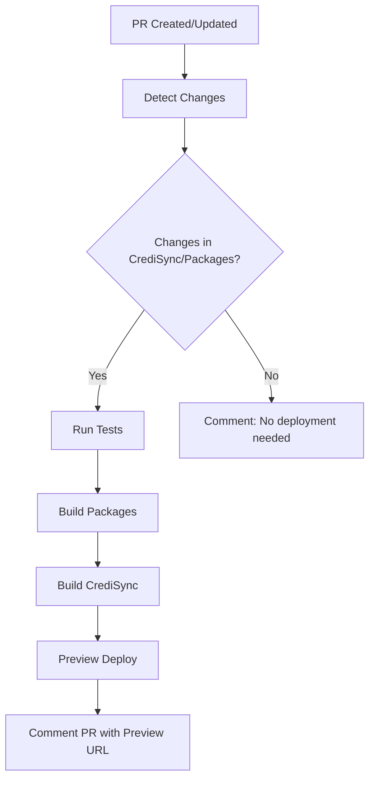
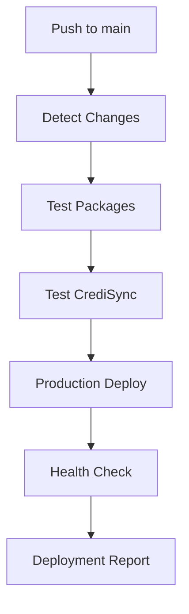

# CI/CD Setup - Sync Platform

## 🎯 Estrategia de CI/CD

El monorepo utiliza **GitHub Actions** para automatizar testing, building y deployment con una estrategia optimizada para monorepos.

## 📋 Workflows Configurados

### 1. **CrediSync Deployment** (`credisync-deploy.yml`)

**Trigger:**
- Push a `main` (production)
- Pull requests a `main` (preview)
- Cambios en: `apps/credisync/`, `packages/@sync/`, archivos de configuración

**Jobs:**
1. **Test Packages** - Ejecuta tests de todos los packages
2. **Test CrediSync** - Ejecuta tests específicos de CrediSync
3. **Preview Deploy** - Deployment de preview para PRs
4. **Production Deploy** - Deployment a producción en main
5. **Health Check** - Verificación post-deployment

**Secrets requeridos:**
```env
VERCEL_TOKEN=your_vercel_token
VERCEL_ORG_ID=your_org_id
VERCEL_PROJECT_ID=credisync_project_id
```

### 2. **Packages Testing** (`packages-test.yml`)

**Trigger:**
- Push a `main` o `develop`
- Pull requests
- Cambios en: `packages/@sync/`, archivos de configuración

**Jobs:**
1. **Lint & Type Check** - ESLint y TypeScript
2. **Unit Tests** - Tests paralelos por package
3. **Build Test** - Verificación de builds
4. **Integration Test** - Tests de integración

**Features:**
- ✅ Tests paralelos por package
- ✅ Coverage reports con Codecov
- ✅ Verificación de builds
- ✅ Tests de integración

### 3. **Conditional Deployment** (`conditional-deploy.yml`)

**Trigger:**
- Push a `main`
- Pull requests a `main`

**Features:**
- 🎯 **Deployment inteligente** basado en cambios
- 📊 **Reporte de deployment** automático
- 🚀 **Solo deploya** lo que cambió
- 📱 **Preparado** para futuras apps (HealthSync, SurveySync)

**Lógica de deployment:**
```yaml
CrediSync: Deploy si cambios en apps/credisync/ O packages/@sync/
HealthSync: Log cambios (deployment futuro)
SurveySync: Log cambios (deployment futuro)
```

### 4. **Preview Deployments** (`preview-deployments.yml`)

**Trigger:**
- Pull requests a `main`
- Tipos: opened, synchronize, reopened

**Features:**
- 🔍 **Detección automática** de cambios
- 💬 **Comentarios en PR** con estado
- ⏭️ **Skip deployment** si no hay cambios relevantes
- 🚀 **Preview URL** automática

## 🔧 Configuración de Secrets

### GitHub Secrets Requeridos:

```bash
# Vercel Integration
VERCEL_TOKEN=your_vercel_token
VERCEL_ORG_ID=your_organization_id
VERCEL_PROJECT_ID=credisync_project_id

# Codecov (opcional)
CODECOV_TOKEN=your_codecov_token
```

### Obtener Vercel Secrets:

```bash
# 1. Instalar Vercel CLI
npm i -g vercel

# 2. Login
vercel login

# 3. Obtener tokens
vercel --help
```

## 📊 Pipeline Flow

### Para Pull Requests:


### Para Production (main):


## 🎯 Optimizaciones Implementadas

### ✅ **Deployment Condicional**
- Solo deploya cuando hay cambios relevantes
- Ahorra tiempo y recursos de CI/CD
- Evita deployments innecesarios

### ✅ **Tests Paralelos**
- Packages se testean en paralelo
- Matriz de testing por package
- Builds optimizados con artifacts

### ✅ **Cache Inteligente**
- pnpm cache automático
- Artifacts entre jobs
- Dependencias optimizadas

### ✅ **Feedback Automático**
- Comentarios en PRs
- Status checks
- Deployment reports

## 🚀 Deployment Strategy

### **Estrategia Actual:**
- **CrediSync**: Deployment automático ✅
- **HealthSync**: Preparado para futuro 🚧
- **SurveySync**: Preparado para futuro 🚧

### **URLs de Deployment:**
- **Production**: https://credisync-green.vercel.app/
- **Preview**: Generada automáticamente por PR

## 📋 Checklist de Setup

### Para Nuevas Apps:
- [ ] Crear workflow específico
- [ ] Configurar Vercel project
- [ ] Agregar secrets necesarios
- [ ] Configurar path filters
- [ ] Actualizar conditional deployment

### Para Nuevos Packages:
- [ ] Agregar a packages-test.yml
- [ ] Configurar build dependencies
- [ ] Agregar coverage reports
- [ ] Actualizar integration tests

## 🔍 Troubleshooting

### Error: "VERCEL_TOKEN not found"
```bash
# Verificar secrets en GitHub
Settings → Secrets and variables → Actions
```

### Error: "Package build failed"
```bash
# Verificar orden de dependencias
pnpm build:packages
```

### Error: "Tests failing in CI but passing locally"
```bash
# Verificar Node.js version
# Verificar pnpm version
# Verificar environment variables
```

## 📈 Métricas y Monitoreo

### **Métricas Automáticas:**
- ✅ Test coverage por package
- ✅ Build times
- ✅ Deployment success rate
- ✅ Health check status

### **Reportes Disponibles:**
- 📊 GitHub Actions summary
- 📈 Codecov reports
- 🚀 Vercel deployment logs
- 💬 PR comments automáticos

## 🎯 Próximos Pasos

1. **Configurar Codecov** para coverage reports
2. **Agregar performance testing** en CI
3. **Configurar alertas** para fallos
4. **Implementar deployment** para HealthSync/SurveySync
5. **Agregar security scanning** automático